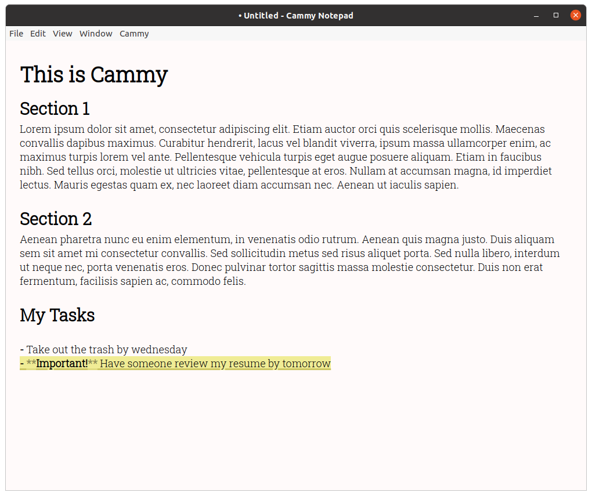
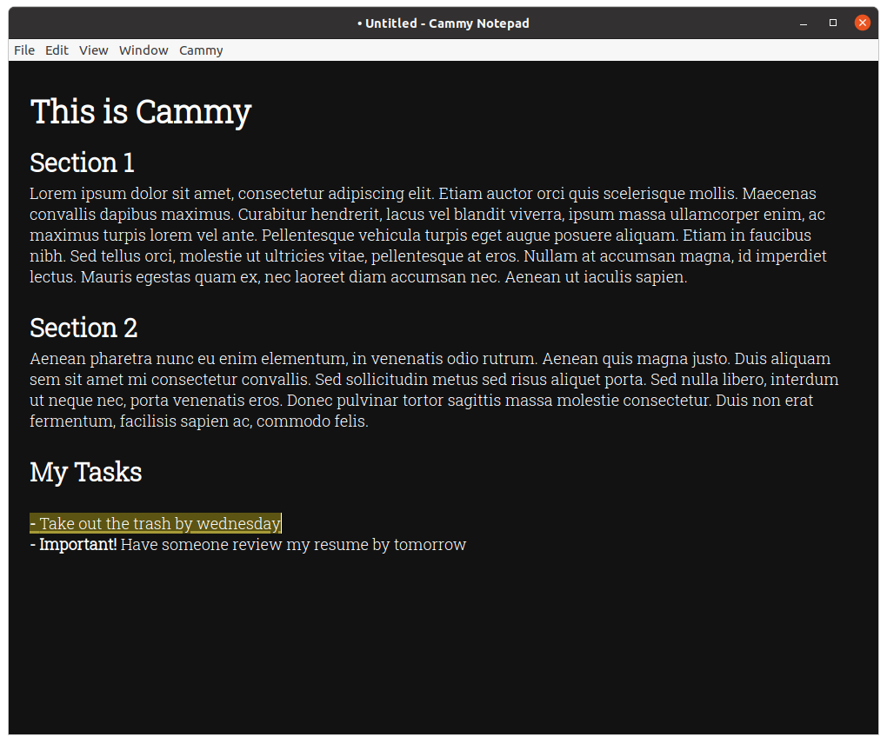
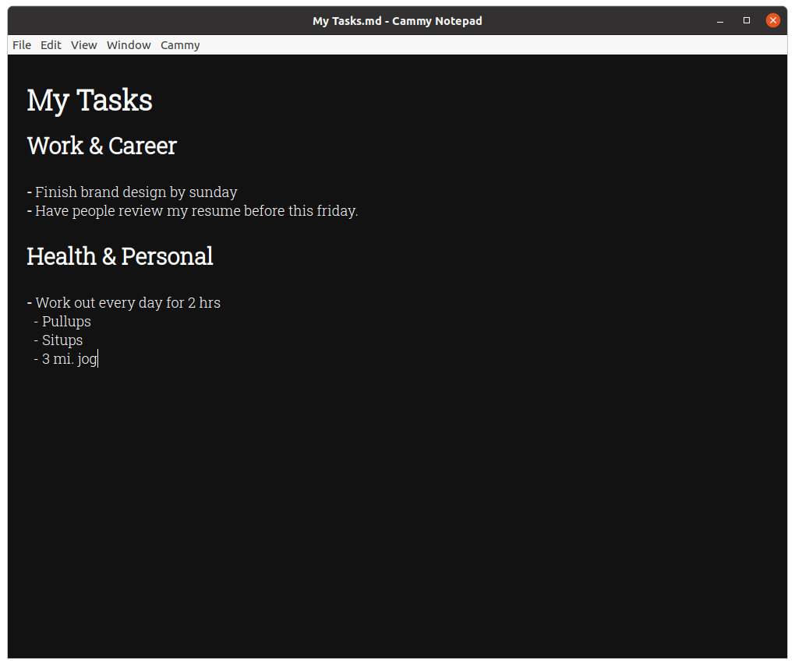
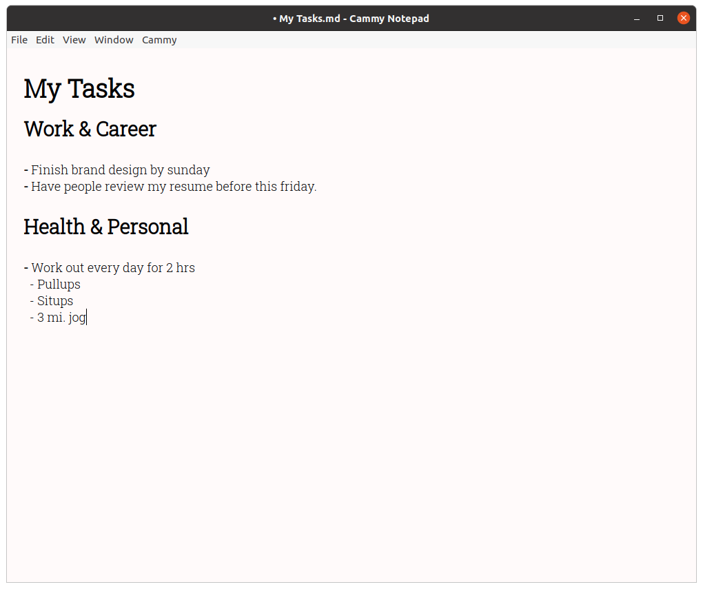

    

---

Cammy is a GNU markdown-based productivity tool that syncs directly with google calendar (support for more calendar applications coming soon).

## Download 

The download page for the latest Linux/OSX/Windows installation packages can be found [here](https://github.com/sripkunda/Cammy/releases). 

## FAQ

### What is it?

Cammy is a free to use, open source tool that allows you to plan out your day in a notepad-like environment while allowing you to sync your most important tasks and events with google calendar. 

### How does it work?

Cammy uses real-time natural language processing to identify dates, tasks, and events as you type. These dates and events are then parsed for important information, such as the title, duration, date, and time of the event/task. Once a match is found, Cammy will allow you to add a task to your calendar app with a single click.

### What makes Cammy special?

Unlike modern productivity tools that restrict the structure and format of your todo lists and calendars to only what is offered in the app, Cammy provides you with ultimate freedom, as if you are writing on a blank sheet of paper. This helps eliminate distractions and maintain a productive environment while working. 

## Screenshots / Features

    
    

    
    

* Automatic Event Recognition
* Multiple Color Themes (Light & Dark)
* Real-time markdown editing for productive note-taking and planning
* Free and Open Source

## Using Cammy

Cammy's editor is built for simplicity. The only thing you will see on the canvas is the editor window, with no additional toolbars or dialogs. 

The editor uses markdown for text formatting. You can learn about markdown and how to use it [here](https://www.markdownguide.org/). *(A bubble tooltip-based toolbar for core formatting features such as headings and bullet-points is in development.)*

### Saving and Opening Files 

Cammy acts as a regular text editor, meaning that you can open, edit, and save new or existing files. The `File` menu has options to save and open files. 

### Adding events to the calendar

Once Cammy recognizes a piece of text as an event, it will automatically highlight it to indicate that it can be automatically added to your calendar (unless event recognition is turned off). There are two ways to add an event to your calendar. 

The first is to press <kbd>Ctrl</kbd> or <kbd>⌘</kbd> <kbd>Shift</kbd> <kbd>A</kbd> while on the line which has a recognized event. The second is to click on the line in the editor window.

### Color Themes & Appearance

To switch the color theme of the editor, navigate to the `Window` menu and click `Switch Color Theme`. Alternatively, press <kbd>Ctrl</kbd> or <kbd>⌘</kbd> <kbd>Shift</kbd> <kbd>,</kbd> on your keyboard.

### Keyboard Shortcuts 

**Editor:**

| Shortcut                                                      | Action                   |
| ------------------------------------------------------------- | ------------------------ |
| <kbd>Ctrl</kbd> or <kbd>⌘</kbd> <kbd>O</kbd>                  | Open File                |
| <kbd>Ctrl</kbd> or <kbd>⌘</kbd> <kbd>S</kbd>                  | Save Current File        |
| <kbd>Ctrl</kbd> or <kbd>⌘</kbd> <kbd>Shift</kbd> <kbd>S</kbd> | Save Current File As     |
| <kbd>Ctrl</kbd> or <kbd>⌘</kbd> <kbd>Shift</kbd> <kbd>A</kbd> | Add to calendar          |
| <kbd>Ctrl</kbd> or <kbd>⌘</kbd> <kbd>Shift</kbd> <kbd>.</kbd> | Toggle Event Recognition |
| <kbd>Ctrl</kbd> or <kbd>⌘</kbd> <kbd>Shift</kbd> <kbd>,</kbd> | Switch Editor Theme      |

**Markdown:**

| Shortcut                                                      | Action            |
| ------------------------------------------------------------- | ----------------- |
| <kbd>Ctrl</kbd> or <kbd>⌘</kbd> <kbd>B</kbd>                  | Bold              |
| <kbd>Ctrl</kbd> or <kbd>⌘</kbd> <kbd>I</kbd>                  | Italic            |
| <kbd>Shift</kbd> <kbd>Ctrl</kbd> or <kbd>⌘</kbd> <kbd>H</kbd> | Large Heading     |
| <kbd>Ctrl</kbd> or <kbd>⌘</kbd> <kbd>H</kbd>                  | Small Heading     |
| <kbd>Ctrl</kbd> or <kbd>⌘</kbd> <kbd>-</kbd>                  | Block Quote       |
| <kbd>Ctrl</kbd> or <kbd>⌘</kbd> <kbd>K</kbd>                  | Insert Link       |
| <kbd>Ctrl</kbd> or <kbd>⌘</kbd> <kbd>L</kbd>                  | Unordered List    |
| <kbd>Ctrl</kbd> or <kbd>⌘</kbd> <kbd>Alt</kbd> <kbd>C</kbd>   | Insert Code Block |

## Credits

This project would not be possible without [EasyMDE](https://github.com/Ionaru/easy-markdown-editor), the core of the markdown editor that has been modified to fit the editing needs of Cammy's real-time markdown-preview. Cammy also uses [compromise](https://github.com/spencermountain/compromise) for natural language processing (how Cammy recognizes events, tasks, dates, etc.).
